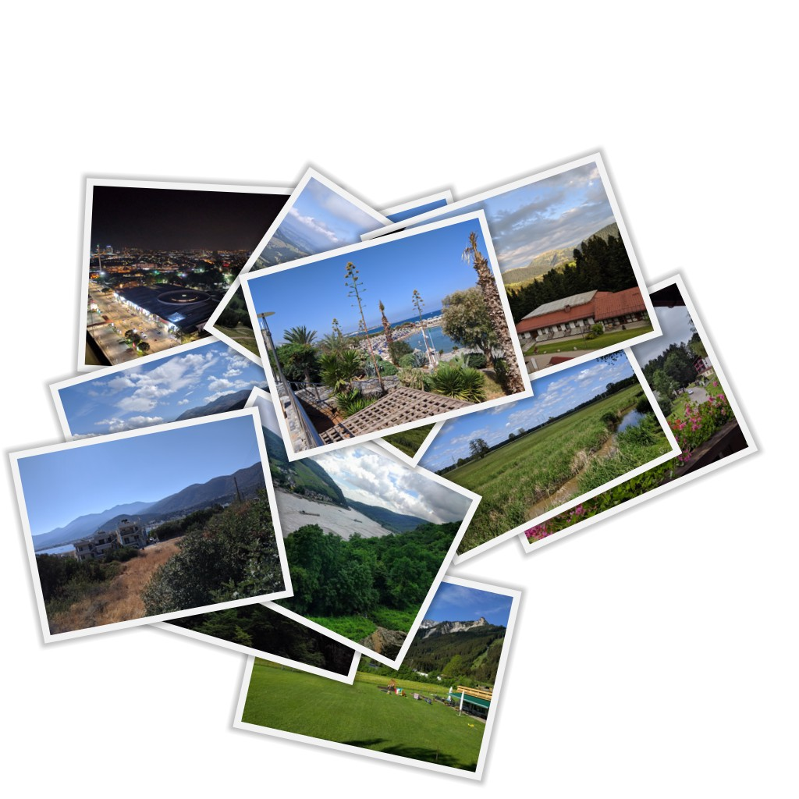

# Collage 

A generator for photo collages that appear do be dropped on a 
stack. It takes a list of names of image files and/or directories
with image files which are then compositied into a collage image
and saved to disk.

